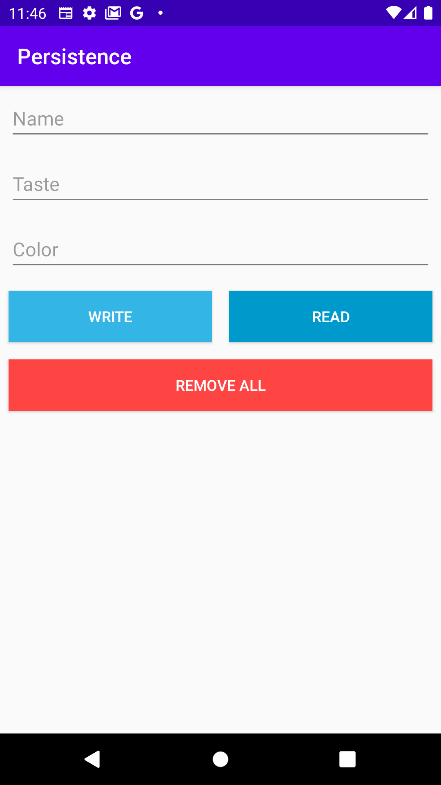
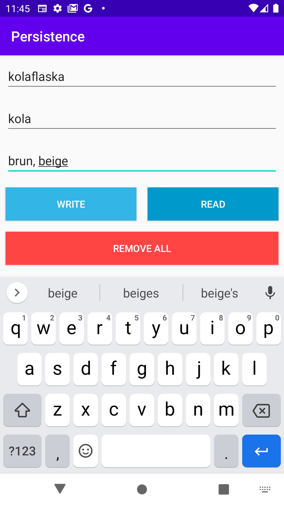
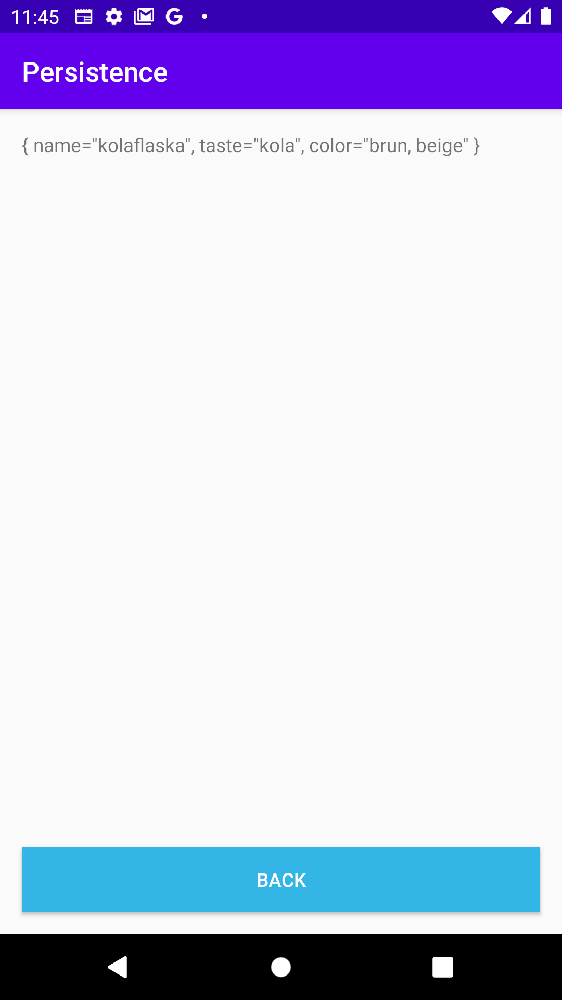

# Rapport

Uppgiften gick ut på att skapa en SQLite databas som man med appen kan skriva och läsa ifrån. I denna app kan man med appen skapa godisar. Man kan även hämta och lista upp de olika godisarna i en SecondActivity.

För att underlätta och minska fel genom appen skapades klasserna ***___DatabaseHelper___*** och ***___DatabaseTables___***. 

Klassen *DatabaseHelper* extendar SQLiteOpenHelper. Denna klass hjälper till att skapa, öppna och hålla koll på egenskaper hos databasen såsom t.ex version.

Klassen *DatabaseTables* består av statiska fält, eller konstanter, som används för att skapa och ta bort databasen. Denna har även en nodell för hur en godis ska se ut i databasen. Denna modell är i from av en innre klass med namn Candy, se kodblock nedan:

```Java
public class Candy {
    static final String COLUMN_NAME = "name"; // primary key
    static final String COLUMN_TASTE = "taste";
    static final String COLUMN_COLOR = "color";
    static final String TABLE_NAME = "Candy";
}
```

Denna används sedan i konstanten *SQL_CREATE_TABLE_CANDY* som finns i *DatabaseTables*, se kodblock nedan:

```Java
public static final String SQL_CREATE_TABLE_CANDY = String.format(
        "CREATE TABLE %s (%s TEXT PRIMARY KEY, %s TEXT, %s TEXT)",
        Candy.TABLE_NAME,
        Candy.COLUMN_NAME,
        Candy.COLUMN_TASTE,
        Candy.COLUMN_COLOR);
```

För att sedan initiera databasen deklarerades följande kod i MainActivity#onCreate(): 

```Java
this.databaseHelper = new DatabaseHelper(this);
this.database = this.databaseHelper.getWritableDatabase();
```

I appvyn (MainActivity) finns det 3 textfält som går att ändra, 2 knappar för att skriva respektive hämta data från databasen. Under dessa knappar finns även en till knapp. Denna knapp raderar alla godisar genom att ta bort tabellen och skapa den på nytt. Alla dessa vyer går att se i bilden nedan:



För att inte få några null-värden på primär nyckeln i databasen kollar appen om värdet på textfältet för namn är en tom String. Skulle detta hända avbryter den processen att lägga in godisen i databasen. Detta sker i funktionen *MainActivity#addCandy()*, se kodblock nedan:

```Java
private boolean addCandy() {
    if (textName.getText().toString().equals("")) {
        Log.e("Write", "Primary key can not be empty string or null");
        return false;
    }

    ContentValues values = new ContentValues();
    values.put(DatabaseTables.Candy.COLUMN_NAME, textName.getText().toString());
    values.put(DatabaseTables.Candy.COLUMN_TASTE, textTaste.getText().toString());
    values.put(DatabaseTables.Candy.COLUMN_COLOR, textColor.getText().toString());

    database.insert(DatabaseTables.Candy.TABLE_NAME, null, values);

    return true;
}
```

När en användare lagt in en godis i databasen kan den trycka på knappen "read" för att lista upp de olika godisarna i databasen. När en användare trycker på denna knapp öppnas en ny activity, SecondActivity, som består av ett textfält. Datan som läses från databasen och som läggs i en ArrayList, skickas då över till den andra aktiviteten där varje godis läggs in i textfältet separerade med '\n'. Denna process går att se i bilderna nedan:


### Användaren fyller textfält med värden


### Användaren sparar och läser in värden från databas

